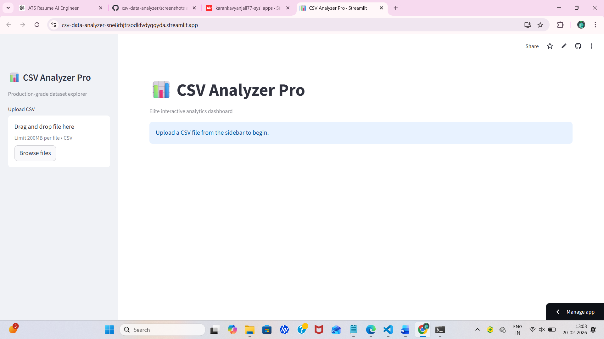
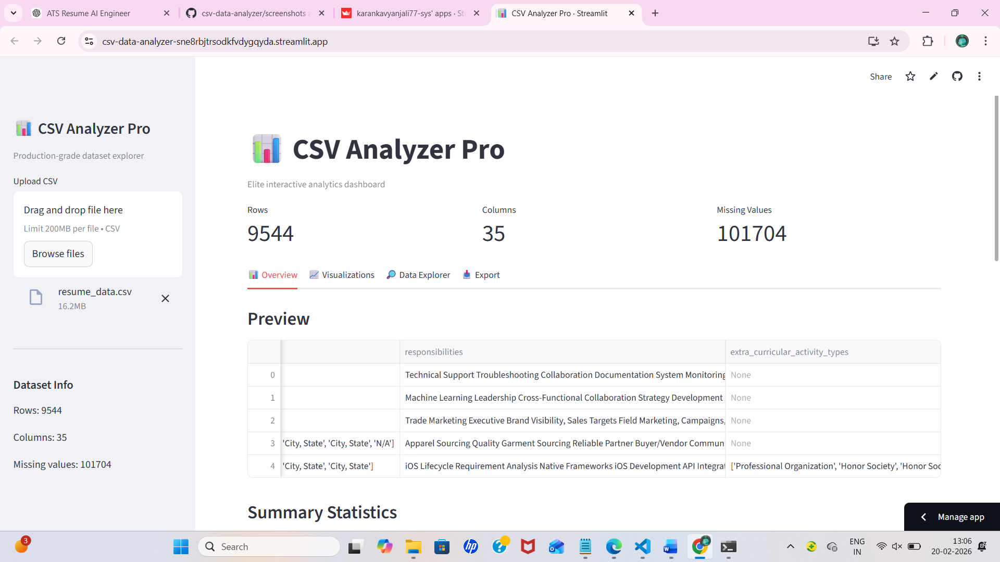
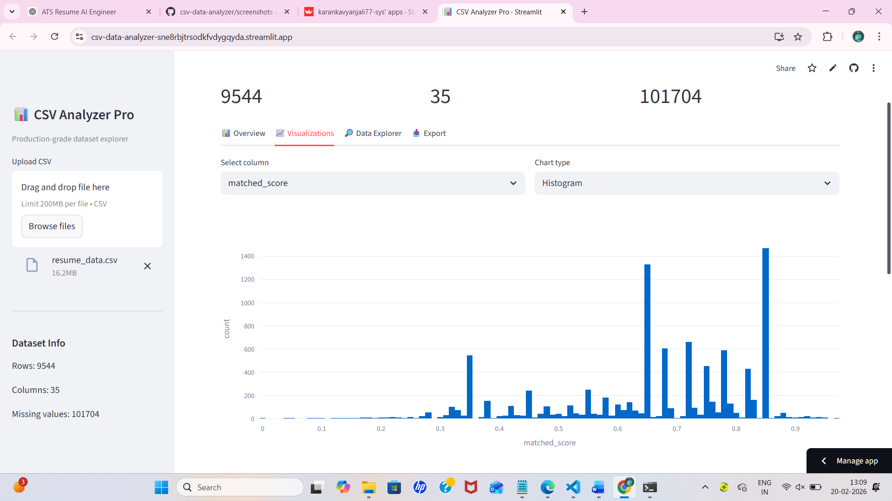
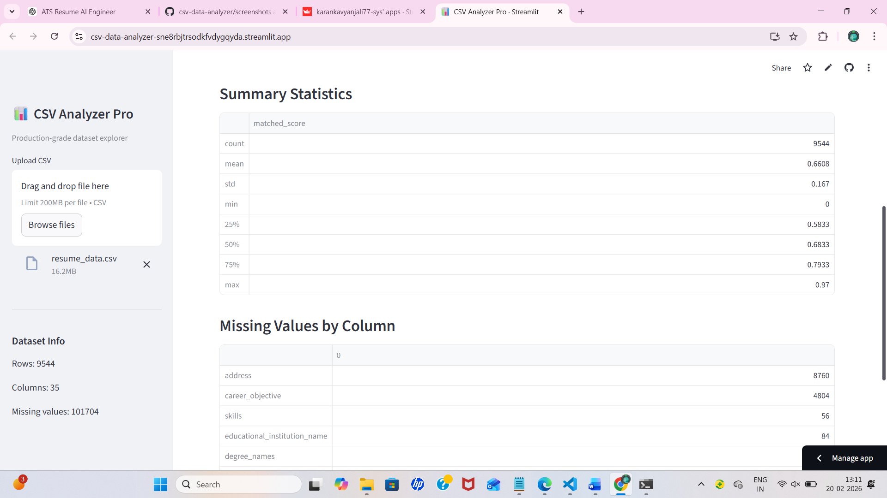

# 📊 CSV Data Analyzer (AI-Ready Data Exploration Tool)

Interactive Streamlit dashboard for fast dataset inspection, cleaning insights, and visualization — built for real-world data analysis workflows.

## 🚀 Live Features
- Upload any CSV instantly
- Automatic dataset profiling (rows, columns, missing values)
- Summary statistics generation
- Interactive visualizations
- Clean dashboard UI for analysts & ML preprocessing

---

## 🖼️ Application Preview

### 🏠 Home Interface


### 📑 Dataset Preview & Metrics


### 📊 Visualizations Dashboard


### 📈 Statistical Analysis


---

## 🛠️ Tech Stack
Python • Pandas • NumPy • Matplotlib • Streamlit

## ▶️ Run Locally
```bash
pip install -r requirements.txt
streamlit run app.py

## 🔮 Future Improvements
- Automatic anomaly detection
- Natural-language dataset summaries
- Exportable reports
